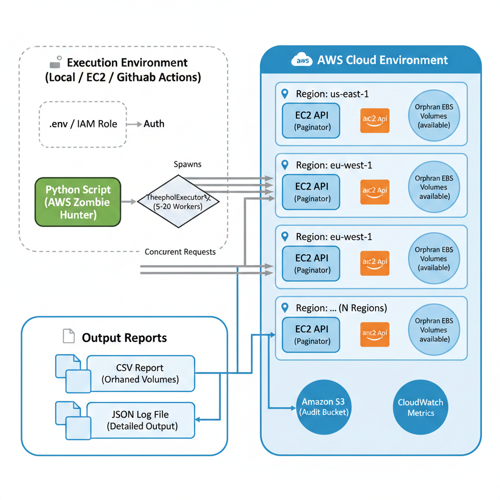

# AWS Zombie Resource Hunter


## Architecture Diagram



An automation tool designed to automatically detect and report **forgotten**, cost-incurring, and unused (**Available** state) EBS volumes within an AWS account.

## 🚀 Features

- **Automatic Discovery:** Scans and identifies orphaned disks in seconds using the AWS API.
- **Smart Filtering:** Specifically targets resources stuck in the `available` state.
- **Detailed Reporting:** Exports discovered resources into a CSV format including details such as ID, size, and creation date.
- **Secure:** Loads AWS credentials from a `.env` file so no sensitive data is hardcoded.
- **Logging:** Tracks every operation with timestamps and severity levels for easier debugging.

## 🛠️ Tech Stack

- Python 3.x
- boto3 (AWS SDK for Python)
- CSV (reporting)
- python-dotenv (environment variable management)

## ⚙️ Installation

Clone the repository:

```bash
git clone https://github.com/emredogan-cloud/aws-zombie-hunter.git
cd aws-zombie-hunter
```

Install dependencies:

```bash
pip install -r requirements.txt
```

## 🔐 Configuration (.env)

Create a `.env` file in the project root and add your AWS credentials:

```env
AWS_ACCESS_KEY_ID=your_access_key
AWS_SECRET_ACCESS_KEY=your_secret_key
AWS_REGION=your_preferred_region
```
## 📋 Usage

Run the main script to start the discovery process:

```bash
python main.py
```


## ✅ Output

Upon completion, a `zombie_resources.csv` file will be generated in the project folder.

