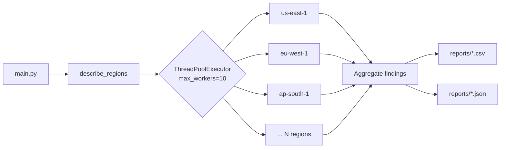

# AWS Zombie Hunter

[](https://github.com/emredogan-cloud/aws-zombie-hunter/actions/workflows/main.yaml)

Parallel, multi-region scanner that finds **orphan EBS volumes** — detached volumes still incurring storage cost — across every region your account has access to, and emits CSV + JSON inventory reports.

Read-only. Never deletes anything.



```mermaid
flowchart LR
    M[main.py] --> D[describe_regions]
    D --> P{ThreadPoolExecutor\nmax_workers=10}
    P --> R1[us-east-1]
    P --> R2[eu-west-1]
    P --> R3[ap-south-1]
    P --> RN[... N regions]
    R1 & R2 & R3 & RN --> AGG[Aggregate findings]
    AGG --> CSV[reports/*.csv]
    AGG --> JSON[reports/*.json]
```

---

## What it does

- Resolves the list of available regions through `ec2.describe_regions` (filtered by your account's opt-in status).
- Fans out a `ThreadPoolExecutor` (`max_workers=10` default).
- For each region, instantiates a regional EC2 client and walks `describe_volumes` with a `Paginator`, filtering for `state=available`.
- Aggregates `VolumeId`, size, type, encryption, AZ, creation time, and tags.
- Writes timestamped CSV + JSON to `reports/`.

`tqdm` provides live progress so a 25-region account doesn't sit in silence.

---

## Repository Layout

```
aws-zombie-hunter/
├── main.py            # AWSZombieHunter class + CLI entry
├── requirements.txt   # boto3, python-dotenv, tqdm
├── Dockerfile         # Multi-stage, non-root user
├── docs/ZombieHunter.png
└── LICENSE
```

---

## Run

```bash
git clone https://github.com/emredogan-cloud/aws-zombie-hunter.git
cd aws-zombie-hunter
pip install -r requirements.txt

cat > .env <<EOF
AWS_ACCESS_KEY_ID=...
AWS_SECRET_ACCESS_KEY=...
AWS_REGION=us-east-1
EOF

python main.py
```

Default behavior: scan **all available regions**. Pin to a single region by setting `AWS_REGION` and adapting the constructor call.

---

## Docker

```bash
docker build -t aws-zombie-hunter:latest .

docker run --rm \
  -v ~/.aws:/home/zombie/.aws:ro \
  -v $(pwd)/reports:/app/reports \
  aws-zombie-hunter:latest
```

Runs as non-root `zombie`, with a healthcheck that verifies the SDK loads.

---

## Required IAM

```json
{
  "Version": "2012-10-17",
  "Statement": [{
    "Effect": "Allow",
    "Action": [
      "ec2:DescribeRegions",
      "ec2:DescribeVolumes"
    ],
    "Resource": "*"
  }]
}
```

`ReadOnlyAccess` works but is broader than needed.

---

## Output

`reports/zombie_volumes_<YYYYMMDD_HHMMSS>.csv` and `.json`:

| Field | Notes |
|---|---|
| `Region` | AWS region |
| `VolumeId` | `vol-…` |
| `Size` | GiB |
| `VolumeType` | `gp3`, `gp2`, `io1`, `io2`, `st1`, `sc1` |
| `Encrypted` | KMS-encrypted at rest |
| `AvailabilityZone` |  |
| `CreateTime` | ISO 8601 |
| `Tags` | Flattened key/value pairs |

---

## Design Notes

- **Per-region client.** The base client is built once for region discovery; each worker constructs its own regional client to avoid signing-region mismatches.
- **`ThreadPoolExecutor`, not `asyncio`.** `boto3` is synchronous; threading is the appropriate concurrency primitive for IO-bound SDK calls.
- **Paginators.** Accounts with thousands of volumes per region are handled correctly without `MaxResults` tuning.
- **No deletion path.** No `delete_volume` call exists by design; remediation is intentionally out of scope and left to a separate audited tool.

---

## License

[MIT](LICENSE)
