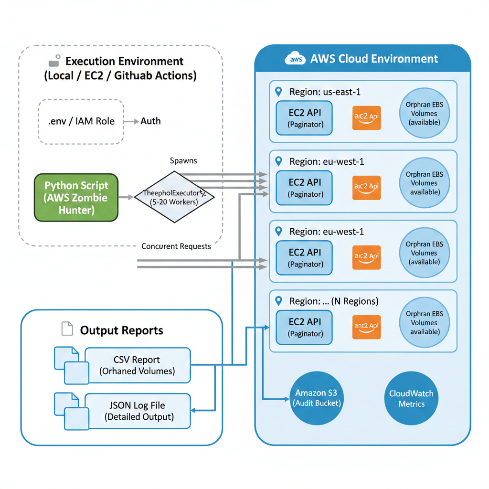

# AWS Zombie Resource Hunter

[](https://github.com/emredogan-cloud/aws-zombie-hunter/actions/workflows/main.yaml)

## Architecture Diagram



Detect and report **forgotten EBS volumes** that waste money. Scans all AWS regions in parallel using boto3 and paginators.

---

## ⚡ Quick Start

### 1️⃣ Install

```bash
git clone https://github.com/emredogan-cloud/aws-zombie-hunter.git
cd aws-zombie-hunter
pip install -r requirements.txt
```

### 2️⃣ Configure Credentials

```bash
# Create .env file
echo "AWS_ACCESS_KEY_ID=your_key" > .env
echo "AWS_SECRET_ACCESS_KEY=your_secret" >> .env
echo "AWS_REGION=us-east-1" >> .env

# Or use AWS CLI
aws configure
```

### 3️⃣ Run Scan

```bash
# Scan all regions (default)
python main.py

# Scan specific regions
python main.py --regions us-east-1 eu-west-1

# With JSON report
python main.py --json-output
```

### 4️⃣ View Results

```bash
# CSV report with all regions
cat zombie_volumes.csv

# Cost estimate
grep "Total Wasted Storage" zombie_volumes.csv
```


### 🐳 Docker (Containerized)

Prefer a reproducible runtime (no local Python dependency headaches)? You can run **AWS Zombie Hunter** as a Docker container.

#### Build image

```bash
docker build -t aws-zombie-hunter .
```

#### Run (recommended: persist reports to your current folder)

```bash
# Uses credentials from .env (AWS_ACCESS_KEY_ID / AWS_SECRET_ACCESS_KEY / AWS_REGION)
# and writes outputs (zombie_volumes.csv + optional JSON) to the current directory.
docker run --rm \
  --env-file .env \
  -v "$PWD:/app" \
  aws-zombie-hunter --json-output
```

#### Run using your AWS CLI profile (~/.aws)

```bash
docker run --rm \
  -v "$HOME/.aws:/home/zombie/.aws:ro" \
  -v "$PWD:/app" \
  aws-zombie-hunter --regions us-east-1 eu-west-1 --workers 10
```

> Tip: Any arguments you pass after the image name are forwarded to `main.py` (the image uses `ENTRYPOINT ["python", "main.py"]`).

---

## 🚀 Features

- **Multi-Region Scanning** — All AWS regions in parallel
- **Paginator Support** — Handles 10,000+ volumes automatically
- **Parallel Execution** — 5-7x faster with concurrent workers
- **Regional Cost Analysis** — Estimates monthly waste per region
- **Dual Export** — CSV and JSON reports
- **Secure** — Credentials in `.env`, no hardcoding
- **Thread-Safe** — Thread-aware logging and error handling
- **Dockerized Runtime** — Multi-stage image + non-root user for a consistent, secure run

---

## 📋 Usage Examples

### Scan All Regions

```bash
python main.py
```

### Scan Specific Regions with 10 Workers

```bash
python main.py --regions us-east-1 eu-west-1 ap-southeast-1 --workers 10
```

### Generate Both CSV and JSON Reports

```bash
python main.py --json-output
```

---

## 📊 Output

### Console Output

```
======================================================================
🔍 AWS ZOMBIE HUNTER - SCAN SUMMARY
======================================================================

  📍 Region: us-east-1
     - Zombie Volumes: 3
     - Total Size: 250 GB

  📍 Region: eu-west-1
     - Zombie Volumes: 2
     - Total Size: 150 GB

----------------------------------------------------------------------
  📊 TOTAL ACROSS ALL REGIONS:
     - Zombie Volumes: 5
     - Total Wasted Storage: 400 GB
     - Estimated Monthly Cost: $40.00 USD (avg)
======================================================================
```

### CSV Report (zombie_volumes.csv)

```
Region,VolumeId,Size (GB),CreateTime,AvailabilityZone,IOPS,Throughput
us-east-1,vol-12345678,100,2024-01-15T10:30:00,us-east-1a,3000,125
eu-west-1,vol-87654321,50,2024-02-10T15:20:00,eu-west-1a,1000,62
```

---

## ⚙️ Options

| Option | Description | Example |
|--------|-----------|---------|
| `--regions` | Scan specific regions | `--regions us-east-1 eu-west-1` |
| `--workers` | Parallel worker threads (default: 5) | `--workers 10` |
| `--json-output` | Generate JSON report | `--json-output` |
| `--help` | Show help message | `--help` |

---

## 📚 Documentation

- **[Installation Guide](docs/INSTALLATION.md)** — Detailed setup instructions
- **[Configuration](docs/CONFIGURATION.md)** — Credentials, IAM, options
- **[Usage Examples](docs/USAGE.md)** — Real-world scenarios
- **[Architecture](docs/ARCHITECTURE.md)** — Technical deep-dive
- **[Troubleshooting](docs/TROUBLESHOOTING.md)** — Common issues

---

## 🔐 Security

- **IAM Policy** — Minimal read-only permissions
- **Credentials** — Never hardcoded, loaded from `.env`
- **Logs** — No sensitive data logged
- **Files** — No credentials in output reports

---

## 💰 Cost Impact

AWS charges **$0.10 per GB/month** for unattached EBS volumes.

**Example:** 400 GB of orphan volumes = **$40/month = $480/year**

This tool helps identify and eliminate these costs.

---

## 🛠️ Tech Stack

- Python 3.7+
- boto3 (AWS SDK)
- concurrent.futures (parallel execution)
- python-dotenv (credential management)
- Docker (containerized runtime)

---

## 📈 Performance

| Scenario | Time | Details |
|----------|------|---------|
| 1 Region | < 2s | Sequential |
| 15 Regions (Sequential) | ~15s | 1s per region |
| 15 Regions (5 workers) | ~3-4s | Parallel speedup |
| 15 Regions (10 workers) | ~2-3s | Optimal speedup |

---

## 🤝 Contributing

Contributions welcome! Areas for enhancement:

- EBS snapshots scanning
- Unattached ENI detection
- Automated cleanup workflows
- DynamoDB export
- CloudWatch integration

---

## 📞 Support

- Check [Troubleshooting](docs/TROUBLESHOOTING.md) for common issues
- Verify AWS credentials: `aws sts get-caller-identity`
- Check IAM permissions: `aws ec2 describe-volumes`

---

## 📜 License

MIT License - See [LICENSE](LICENSE) for details.

---

**AWS Zombie Hunter v2.1** — Multi-Region Parallel Scanner with Paginator Support  
**Status:** Production Ready ✨  
**Scalability:** Handles 50,000+ volumes efficiently
